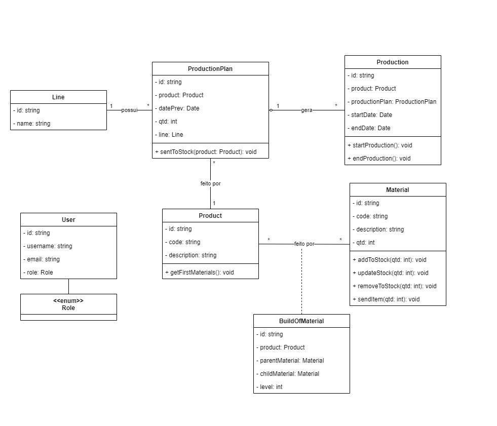
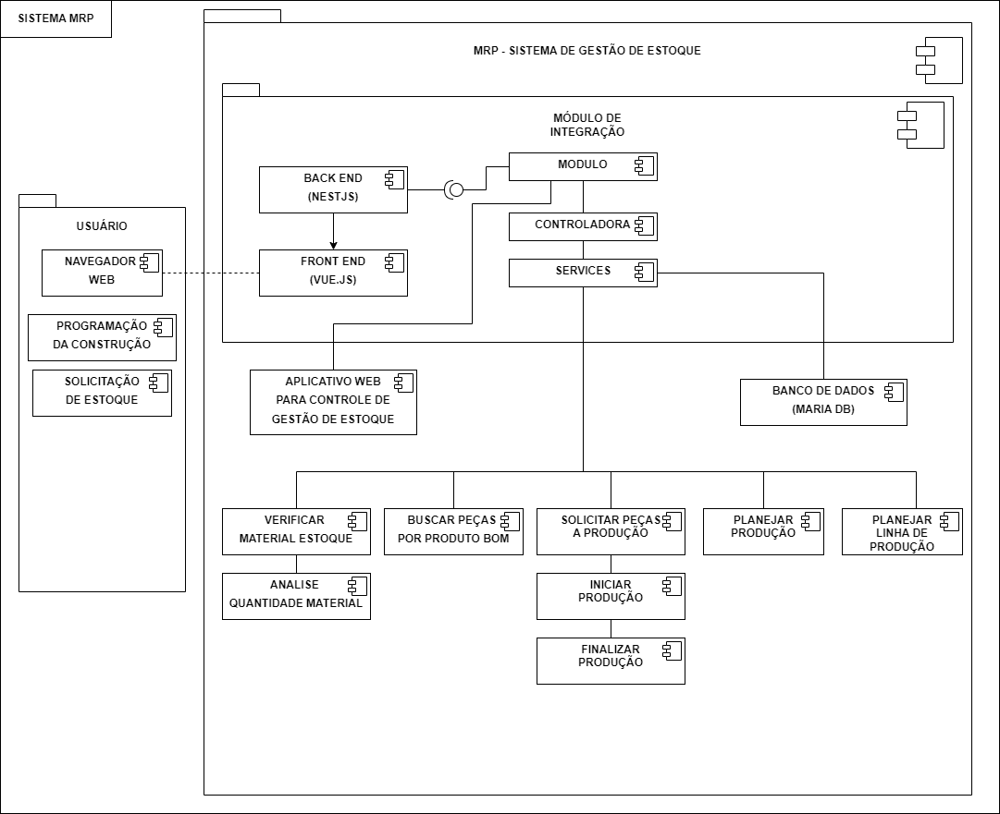

# MRP

* Daniel Estevam Pacheco de Souza, 1381298@sga.pucminas.br
* Eduardo Bandeira de Melo Guimarães, 	1336504@sga.pucminas.br
* Eric Rodrigues Diniz, 1283264@sga.pucminas.br

* Lucas Machado de Oliveira Andrade, 1377053@sga.pucminas.br
* Mariana Eliza Alves Costa, 1078276@sga.pucminas.br
* Vítor Lion Guimarães Rodrigues, 1323991@sga.pucminas.br
---

Professores:

* Cleiton Silva Tavares
* Hugo Bastos de Paula
* Ramon Lacerda Marques

---

Curso de Engenharia de Software, Unidade Praça da Liberdade

Instituto de Informática e Ciências Exatas – Pontifícia Universidade de Minas Gerais (PUC MINAS), Belo Horizonte – MG – Brasil

---

*Resumo*. Este projeto visa o desenvolvimento de um sistema de Manufacturing Resource Planning (MRP) focado na otimização e automação dos processos de planejamento de recursos em uma linha de produção. O sistema oferece funcionalidades essenciais, como cadastro e gestão de produtos, materiais, e hierarquias, bem como controle de estoque e gestão de operadores, acessíveis tanto via web quanto dispositivos móveis. A solução incorpora serviços de mensageria utilizando Kafka, autenticação segura com JWT, e testes automatizados para garantir a robustez e confiabilidade do sistema. Como resultado, o sistema promete melhorar a eficiência operacional, reduzir custos e garantir a disponibilidade de materiais, proporcionando uma visão centralizada e estratégica das operações de manufatura.

---

## Histórico de Revisões

| *Data* | *Autor* | *Descrição* | *Versão* |
| --- | --- | --- | --- |
| *[15/08/2024]* | [Eric Rodrigues Diniz] | [Alteração do nome do projeto, nome dos alunos, sumário. Criação do resumo, histórico de versões, requisitos funcionais e não funcionais.] | [1.0] |
| *[15/08/2024]* | [Eric Rodrigues Diniz] | [Alteração da seção 1: apresentação, problema, objetivos do trabalho. Em seguida, seção 2.3: Restrições Arquiteturais, e seção 2.4: Mecanismos Arquiteturais] | [1.1] |
| *[16/08/2024]* | [Mariana Eliza Alves Costa] | [Adição de detalhes sobre o uso de Flutter para mobile] | [1.2]      |
| *[16/08/2024]* | [Mariana Eliza Alves Costa] | [Adição de Definições e Abreviaturas] | [1.3]      |
| *[16/08/2024]* | [Eric Rodrigues Diniz] | [Adição do diagrama de visão geral na seção 3] | [1.4]      |
| *[19/08/2024]* | [Eric Rodrigues Diniz] | [Adição das Funcionalidades Previstas do Sistema na seção 3.1] | [1.5]      |
| *[19/08/2024]* | [Eduardo Bandeira de Melo] | [Adição de histórias de usuário na seção 3.1] | [1.6] |
| *[31/08/2024]* | [Vítor Lion Guimarães Rodrigues] | [Revisão Seção 1.2: Objetivo Geral] | [1.7] |
| *[03/09/2024]* | [Eric Rodrigues Diniz] | [Revisão da seção 2.2 e 3.1: Requisitos Não-Funcionais e Histórias de usuário ] | [1.8] |
| *[04/09/2024]* | [Eric Rodrigues Diniz] | [Revisão da seção 2.2: Requisitos Não-Funcionais] | [1.9] |
| *[13/10/2024]* | [Eduardo Bandeira] | [Revisão das seções 2.1 e 2.2 (requisitos funcionais e requisitos não-funcionais)] | [1.10] | 

## SUMÁRIO

1. [Apresentação](#apresentacao "Apresentação")  
	1.1. Problema  
	1.2. Objetivos do trabalho  
	1.3. Definições e Abreviaturas  

2. [Requisitos](#requisitos "Requisitos")  
	2.1. Requisitos Funcionais  
	2.2. Requisitos Não-Funcionais  
	2.3. Restrições Arquiteturais  
	2.4. Mecanismos Arquiteturais  

3. [Modelagem](#modelagem "Modelagem e projeto arquitetural")  
	3.1. Visão de Negócio  
	3.2. Visão Lógica  
	3.3. Modelo de dados (opcional)  

4. [Solução](#solucao "Projeto da Solução")  

5. [Avaliação](#avaliacao "Avaliação da Arquitetura")  
	5.1. Cenários  
	5.2. Avaliação  

6. [Referências](#referencias "REFERÊNCIAS") 

7. [Apêndices](#apendices "APÊNDICES") 

# 1. Apresentação

O projeto de desenvolvimento de um sistema Manufacturing Resource Planning (MRP) surge como uma resposta às crescentes demandas das indústrias por eficiência operacional e otimização de recursos. Em um contexto onde a gestão de estoques e a sincronização das operações de produção são cruciais, muitas empresas enfrentam desafios significativos, como o risco de rupturas de estoque ou, inversamente, a acumulação excessiva de materiais. Estes problemas não apenas afetam a produtividade, mas também impactam diretamente os custos operacionais.

O modelo tradicional de produção, como o Just in Time (JIT) e o Sistema Toyota de Produção (STP), embora eficazes, dependem fortemente de uma comunicação ágil e precisa entre diferentes setores da empresa, algo que muitas vezes falta nas operações modernas.

## 1.1. Problema

A falta de visibilidade em tempo real sobre o inventário e a comunicação ineficiente entre os setores de produção, estoque e compras nas indústrias resultam em dois problemas principais: rupturas de estoque, que interrompem o fluxo de produção e impactam a satisfação do cliente, e o acúmulo excessivo de materiais, que aumenta os custos operacionais e causa desperdício. Esses desafios são exacerbados pela ausência de sistemas integrados que prevejam com precisão as necessidades de materiais, levando a ineficiências operacionais que comprometem a competitividade das empresas no mercado.

## 1.2. Objetivos do trabalho

Desenvolver um sistema para automatizar o planejamento de recursos em uma linha de produção e a gestão de estoque, sincronizando as operações e identificando problemas como rupturas de estoque e acúmulo excessivo de materiais. O objetivo é centralizar e otimizar o controle de inventário, melhorar a comunicação entre as áreas de produção, estoque e compras, além de utilizar uma abordagem orientada a dados e integração em tempo real. Assim, espera-se reduzir custos, minimizar perdas por ruptura e aprimorar a eficiência operacional, tornando o sistema uma ferramenta essencial para a gestão moderna da cadeia de suprimentos.

Objetivos específicos deste projeto incluem:

* Desenvolver uma arquitetura que integre de forma eficaz as funções de controle de inventário, gestão de ordens de produção e previsão de demanda, garantindo uma visão centralizada das operações de manufatura.
* Implementar serviços de mensageria em tempo real utilizando Kafka, assegurando a comunicação dinâmica e eficiente entre os setores de produção, estoque e compras.
* Apresentar as estratégias de autenticação e segurança da aplicação, com foco no uso de senhas hash e login via JWT, para proteger as informações críticas do sistema.
* Explorar as abordagens para testes automatizados, incluindo testes unitários com JEST e testes de ponta a ponta utilizando PLAYWRIGHT, com o intuito de garantir a confiabilidade e robustez do sistema em diferentes cenários de uso.

## 1.3. Definições e Abreviaturas

| 
Abreviatura
 | 
Significado
 |
|-------------|------------------------------------------------|
| MRP         | Manufacturing Resource Planning                |
| JIT         | Just in Time                                   |
| STP         | Sistema Toyota de Produção                     |
| Kafka       | Apache Kafka                                   |
| JWT         | JSON Web Tokens                                |
| JEST        | JavaScript Testing Framework                   |
| PLAYWRIGHT  | Playwright                                     |
| ORM         | Object-Relational Mapping                      |
| SPA         | Single Page Application                        |
| API         | Application Programming Interface              |
| HTTPS       | Hypertext Transfer Protocol Secure             |
| SSL/TLS     | Secure Sockets Layer / Transport Layer Security|
| NodeJS      | Node.js                                        |
| Vue.js      | Vue.js                                         |
| Flutter     | Flutter                                        |
| RESTful     | Representational State Transfer                |
| DER         | Diagrama de Entidade-Relacionamento            |
| RF          | Requisito Funcional                            |
| RNF         | Requisito Não-Funcional                        |

# 2. Requisitos

Esta seção descreve os requisitos comtemplados nesta descrição arquitetural, divididos em dois grupos: funcionais e não funcionais.

| *ID*   | *Descrição*                                                                 | *Prioridade* | *Plataforma* |
|----------|-------------------------------------------------------------------------------|----------------|:-------------------:|
| *RF001*    | Como gestor de produção, devo ser capz de gerenciar produtos | Essencial | web |
| *RF002*    | Como gestor de produção, devo ser capz de gerenciar materiais | Essencial | web |
| *RF003*    | Como gestor de produção, devo ser capaz de gerenciar a hierarquia de produção e receber notificações em tempo real sobre as mudanças no planejamento de operaçoes| Essencial | web e mobile |
| *RF004*    | Como gestor de produção, devo receber alertas automáticos sobre baixos níveis de estoque ou necessidade de reposição | Essencial | web e mobile |
| *RF005*    | Como gestor de produção, devo ser capaz de fazer o cadastro de novos produtos e materiais | Essencial | web |
| *RF006*    | Como gestor de produção, devo ser capaz de fazer o planejamento de operações e alocação de recursos para otimizar a produção | Essencial | web |
| *RF007*    | Como gestor de produção, devo ser capaz de cadastrar usuários com nome, e-mail, senha e definição de um papel | Essencial | web |
| *RF008*    | Como gestor de produção, operador de produção e técnico de estoque, devo ser capaz de me autenticar por e-mail e senha para acessar funções personalizadas com base no meu papel | Essencial | web e mobile |
| *RF009*    | Como operador de produção, devo ser capaz de criar alertas de problemas com peças | Essencial | web e mobile |
| *RF010*    | Como operador de produção, devo ser capaz de realizar o cadastro e gestão de linhas e postos de montagem | Essencial | web |
| *RF011*    | Como operador de produção, devo ser capaz de realizar o registro de início e fim da produção | Essencial | mobile |
| *RF012*    | Como operador de produção, devo ser capaz de realizar solicitação de peças extras diretamente do chão de fábrica | Essencial | mobile |
| *RF013*    | Como operador de produção, devo ser capaz de comuniar, em tempo real, sobre atividades de operação com outros setores | Essencial | web e mobile |
| *RF014*    | Como operador de produção, devo ser capaz de sinalizar o fim da produção | Essencial | mobile |
| *RF015*    | Como operador de produção, devo ser capaz de sinalizar o início de produção | Essencial | web e mobile |
| *RF016*    | Como operador de produção ou técnico de estoque, devo ser capaz de descartar peças defeituosas | Essencial | web e mobile |
| *RF017*    | Como técnico de estoque, devo ser capaz de atualizar o estoque mediante reabastecimento de peças | Essencial | mobile |
| *RF018*    | Como técnico de estoque, devo ser capaz de atualizar o estoque mediante saída de peças que foram encaminhadas para linha de produção | Essencial | mobile |
| *RF019*    | Como técnico de estoque, devo ser capaz de sinalizar peças em nível crítico | Essencial | mobile |
| *RF020*    | Como técnico de estoque, devo ser capaz de realizar o gerenciamento e monitoramento do estado das peças no inventário | Essencial | web e mobile |
| *RF021*    | Como gestor de produção, devo receber alertas em tempo real quando níveis críticos de materiais forem atingidos ou eventos importantes ocorrerem| Essencial | web e mobile |
| *RF022*    | Como gestor de produção, devo ser capaz de realizar o planejamento da produção | Desejável | web |
| *RF023*    | Como gestor de produção, devo ser capaz de realizar a gestão de pessoas | Desejável | web |
| *RF024*    | Como operador de produção, devo ser capaz de realizar a gestão de linha de montagem | Desejável | web |
| *RF025*    | Como operador de produção, devo ser capaz de solicitar peças sobressalentes individualmente para caso de quebras ou defeitos de produção| Opcional | mobile |
| *RF026*    | Como operador de produção, devo ser capaz de sinalizar defeitos na produção  | Opcional | mobile |

## 2.2. Requisitos Não-Funcionais

| *ID*   | *Descrição* |
|------------|-------------------------------------------------------------|
| *RNF001* | Todas as senhas devem ser gravadas utilizando sistema de criptografia em Hash|
| *RNF002* | Disponibilização do serviço em HTTPS em nuvem pública|
| *RNF003* | O sistema deve ser capaz de lidar com até 60 acessos simultâneos sem comprometer o desempenho|
| *RNF004* | Todas as comunicações do sistema devem ser criptografadas utilizando SSL/TLS|
| *RNF005* | O sistema deve ter uma disponibilidade de 99%, com downtime máximo de 3 horas por mês|
| *RNF006* | O sistema deve ser fácil de usar, com uma curva de aprendizado que não exceda 2 horas para novos usuários|
| *RNF007* | O sistema deve ser capaz de operar nos navegadores Google Chrome a partir da versão 90 e Safari da versão 17, sem modificações|
| *RNF008* | O sistema deve ser capaz de operar no Android a partir da versão 13 e iOS 15|
| *RNF009* | A comunicação entre o sistema e os usuários deve ser criptografada para proteger dados sensíveis|
| *RNF010* | O sistema deve garantir atualizações e comunicação de status em tempo real com intervalos de até 1 minuto|

## 2.3. Restrições Arquiteturais

As restrições arquiteturais impostas ao projeto, que limitam as soluções candidatas e devem ser consideradas no desenvolvimento do sistema MRP, são as seguintes:

- O software deverá ser desenvolvido em NodeJS para o backend, que oferece suporte robusto para criação de serviços web escaláveis.
- A interface do usuário para a web deverá ser implementada em Vue.js, garantindo uma experiência de usuário interativa e responsiva.
- A interface para dispositivos móveis deverá ser desenvolvida utilizando Flutter, permitindo a criação de uma aplicação multiplataforma com desempenho próximo ao nativo.
- A comunicação da API entre frontend e backend deve seguir o padrão RESTful, facilitando a integração e a interoperabilidade entre os diferentes componentes do sistema.
- O sistema de mensageria deve ser implementado utilizando Apache Kafka, para assegurar a entrega de mensagens em tempo real e a alta disponibilidade do sistema.
- As credenciais dos usuários devem ser armazenadas utilizando hashing seguro, preferencialmente com bcrypt, garantindo a proteção dos dados sensíveis.
- O mecanismo de autenticação e autorização deve ser baseado em JSON Web Tokens (JWT), proporcionando uma maneira segura e escalável de gerenciar sessões de usuários.
- A solução deve ser hospedada em serviços de nuvem, utilizando AWS, aproveitando seus recursos para escalabilidade, segurança e disponibilidade contínua.
- Os testes automatizados devem ser conduzidos utilizando JEST para testes unitários e PLAYWRIGHT para testes de ponta a ponta, assegurando a qualidade e a funcionalidade do sistema em diferentes ambientes de uso.

## 2.4. Mecanismos Arquiteturais

| *Análise*           | *Design*                          | *Implementação*                     |
|:------------------|:--------------------------------|:----------------------------------|
| Persistência      | ORM                             | Hibernate                         |
| Front end         | Single Page Application (SPA)   | Vue.js                            |
| Mobile            | Dispositivo móvel               | Flutter                           |
| Back end          | Framework Web para APIs RESTful | Node.js                           |
| Integração        | APIs RESTful                    | Axios        		         	  |
| Log do sistema    | Logging Framework               | Logback                           |
| Teste de Software | Test-Driven Development (TDD)   | Jest e Playwright 				  |
| Deploy            | CI/CD Pipelines                 | AWS                     		  |

# 3. Modelagem e Projeto Arquitetural

Apresente uma visão geral da solução proposta para o projeto e explique brevemente esse diagrama de visão geral, de forma textual. Esse diagrama não precisa seguir os padrões da UML, e deve ser completo e tão simples quanto possível, apresentando a macroarquitetura da solução.

*Figura 1 - Visão Geral da Solução (fonte: https://medium.com)*

Obs: substitua esta imagem por outra, adequada ao seu projeto (cada arquitetura é única).

## 3.1. Visão de Negócio (Funcionalidades)

Apresente uma lista simples com as funcionalidades previstas no projeto (escopo do produto).

### Funcionalidades Previstas do Sistema

1. O sistema deve permitir o cadastro de produtos, materiais e hierarquias através de uma interface web para gestores.

2. O sistema deve possibilitar a adição e a remoção de peças do estoque via aplicativo móvel, direcionado ao pessoal do setor de Estoque.

3. O sistema deve permitir o apontamento do início e fim da construção dos produtos pelos operadores através do aplicativo móvel.

4. O sistema deve enviar alertas automáticos para todos os usuários (gestores, operadores e pessoal do estoque) via web e mobile.

5. O sistema deve permitir a solicitação de peças por operadores diretamente no chão de fábrica utilizando o aplicativo móvel.

6. O sistema deve oferecer ferramentas para o planejamento de operações e a gestão de operadores, acessíveis via interface web para gestores.

7. O sistema deve gerenciar peças próximas do rompimento, permitindo o acompanhamento detalhado e as ações corretivas por gestores via web.

8. O sistema deve permitir a sinalização de defeitos e a solicitação de peças extras pelos operadores através do aplicativo móvel.

9. O sistema deve fornecer funcionalidades para o cadastro de linhas e postos de montagem por gestores através da interface web.

10. O sistema deve garantir a comunicação em tempo real entre os setores de produção, estoque e compras utilizando serviços de mensageria (Kafka).

Obs: a quantidade e o escopo das funcionalidades deve ser negociado com os professores/orientadores do trabalho.

### Histórias de Usuário

*Cadastro de Produtos e Materiais:*
- *Como usuário*, registrado, 
eu quero fazer login no sistema utilizando meu e-mail e senha, 
para que eu possa acessar as funcionalidades disponíveis e personalizadas para minha conta.

- *Como gestor*, eu quero poder cadastrar novos produtos e materiais no sistema, para que eu possa garantir que todas as informações necessárias estejam disponíveis para a produção.

*Adição e Remoção de Estoque:*

- *Como responsável pelo estoque*, eu quero poder adicionar ou remover peças do estoque, para que eu possa manter o inventário sempre atualizado e preciso.

*Apontamento de Construção:*

- *Como operador*, eu quero poder registrar o início e o fim da construção de produtos, para que eu possa documentar corretamente o progresso da produção.

*Solicitação de Peças Extras:*

- *Como operador*, eu quero poder solicitar peças extras diretamente do chão de fábrica, para que eu possa evitar atrasos na produção devido à falta de materiais.

*Gestão de Operadores e Planejamento de Operações:*

- *Como gestor*, eu quero poder gerenciar a equipe de operadores e planejar as operações, para que eu possa otimizar o uso dos recursos e garantir a eficiência da produção.

*Serviço de Alerta:*

- *Como usuário (gestor, operador ou responsável pelo estoque)*, eu quero receber alertas automáticos quando certas condições forem atingidas, como níveis baixos de estoque, para que eu possa agir rapidamente e evitar problemas.

*Gestão de Ruptura:*

- *Como gestor*, eu quero poder monitorar e gerenciar peças próximas do rompimento no sistema, para que eu possa tomar medidas proativas e evitar interrupções na produção.

*Sinalização de Defeitos:*

- *Como responsável pelo estoque*, eu quero poder sinalizar defeitos em peças, para que eu possa garantir que apenas materiais de qualidade sejam utilizados na produção.

*Cadastro de Linhas e Postos de Montagem:*

- *Como gestor*, eu quero poder cadastrar novas linhas e postos de montagem no sistema, para que eu possa adaptar a produção a diferentes tipos de produtos ou requisitos.

*Comunicação em Tempo Real:*

- *Como usuário do sistema (gestor, operador ou responsável pelo estoque)*, eu quero que todas as minhas ações sejam comunicadas em tempo real para os outros setores, para que todos estejam alinhados e informados sobre o estado atual da produção e do estoque.

## 3.2. Visão Lógica

Apresente os artefatos que serão utilizados descrevendo em linhas gerais as motivações que levaram a equipe a utilizar estes diagramas.

### Diagrama de Classes

*Figura 2 – Diagrama de classes (exemplo). Fonte: o próprio autor.*

Obs: Acrescente uma breve descrição sobre o diagrama apresentado na Figura 3.

### Descrição Geral do Diagrama de Classes

Este diagrama de classes representa a estrutura de um sistema MRP, destacando as principais entidades e suas interações:

1. *ProductionPlan (Plano de Produção): Planeja e aprova a produção, relacionado com **Production* para iniciar e finalizar.
2. *Production (Produção)*: Gerencia o processo de produção, vinculado a um plano de produção.
3. *Product (Produto)*: Detalha os produtos a serem fabricados, vinculado ao plano de produção.
4. *Material*: Descreve e gerencia os materiais necessários para a produção, interligando produtos, estoque, fornecedores e necessidades.
5. *Stock (Estoque)*: Controla o estoque de materiais, verificando e separando o necessário para a produção.
6. *Need (Necessidade)*: Representa as necessidades de materiais para a produção, gerando solicitações e aprovações.
7. *Supplier (Fornecedor)*: Gerencia fornecedores e materiais fornecidos, enviando solicitações conforme necessário.
8. *Purchase (Compra)*: Gerencia o processo de compra de materiais, da solicitação à entrega.
9. *User (Usuário)*: Gerencia usuários, suas permissões e autenticação.

### Relações Entre as Classes

O diagrama reflete como as classes interagem para gerenciar o planejamento, execução da produção, controle de estoque, e compras, assegurando a eficiência do sistema MRP.

### Diagrama de componentes

Apresente o diagrama de componentes da aplicação, indicando, os elementos da arquitetura e as interfaces entre eles. Liste os estilos/padrões arquiteturais utilizados e faça uma descrição sucinta dos componentes indicando o papel de cada um deles dentro da arquitetura/estilo/padrão arquitetural. Indique também quais componentes serão reutilizados (navegadores, SGBDs, middlewares, etc), quais componentes serão adquiridos por serem proprietários e quais componentes precisam ser desenvolvidos.

*Figura 3 – Diagrama de Componentes (exemplo). Fonte: o próprio autor.*

Apresente uma descrição detalhada dos artefatos que constituem o diagrama de implantação.

Ex: conforme diagrama apresentado na Figura X, as entidades participantes da solução são:

### Descrição dos Componentes do Diagrama de Gestão de Estoque

1. *Usuário*:
   - *Navegador Web*: Interface através da qual o usuário interage com o sistema para realizar ações como programação da produção, solicitação de estoque, solicitação de peça extra, gestão de rupturas e compras.

2. *Front-end (Vue.js)*:
   - *Aplicativo Web para Controle de Gestão de Estoque*: Desenvolvido em Vue.js, este aplicativo permite ao usuário visualizar e gerenciar o estoque, executar ajustes de pedidos, e validar solicitações diretamente no navegador.

3. *Back-end (Spring Boot)*:
   - *Controladora*: Gerencia a comunicação entre o front-end e o back-end, processando solicitações do usuário e enviando os dados necessários.
   - *Services*: Camada de serviços que contém a lógica de negócios, como verificação de materiais em estoque, busca de peças, e confirmação de compras.

4. *Banco de Dados (MariaDB)*:
   - Armazena todas as informações essenciais do sistema, incluindo dados sobre materiais, fornecedores, pedidos de compra, e estado do estoque.

5. *Módulo de Integração*:
   - Facilita a interação entre os diferentes componentes do sistema, garantindo que as ações realizadas no front-end sejam refletidas corretamente no banco de dados e nos serviços do back-end.

6. *Funções de Gestão de Estoque*:
   - *Verificar Material Estoque*: Consulta o banco de dados para validar a quantidade de materiais disponíveis.
   - *Buscar Peças Estoque*: Localiza peças específicas dentro do estoque.
   - *Verificar Peças Faltantes*: Identifica materiais que precisam ser repostos para evitar rupturas.
   - *Confirmar Peças*: Registra a chegada de materiais ao estoque e atualiza os níveis de estoque.
   - *Cadastrar Compra*: Processa novas compras de materiais, incluindo a quantidade solicitada e a data de entrega esperada.

Este sistema integra as funcionalidades necessárias para gerenciar de forma eficiente o estoque em um ambiente de produção, garantindo que todas as operações sejam realizadas de maneira sincronizada entre o front-end, back-end e banco de dados.

## 3.3. Diagrama Lógico

Caso julgue necessário para explicar a arquitetura, apresente o diagrama de classes ou diagrama de Entidade/Relacionamentos ou tabelas do banco de dados. Este modelo pode ser essencial caso a arquitetura utilize uma solução de banco de dados distribuídos ou um banco NoSQL.

 ")

*Figura 4 – Diagrama de Entidade Relacionamento (ER) - exemplo. Fonte: o próprio autor.*

### Descrição Geral do Diagrama de Entidade-Relacionamento (DER)

1. *Production Plan (Plano de Produção)*:
   - Detalha os planos de produção, incluindo datas e quantidades, e se relaciona com *Production*.

2. *Production (Produção)*:
   - Armazena informações sobre produções específicas, vinculadas ao plano de produção.

3. *Need (Necessidade)*:
   - Registra as necessidades de materiais para a produção, associada a *Production* e *Material*.

4. *Product (Produto)*:
   - Define os produtos, incluindo descrição e código, e se relaciona com *Production Plan* e *Hierarchies*.

5. *Material*:
   - Descreve os materiais necessários para a produção, vinculados a *Stock, **Supplier* e *Hierarchies*.

6. *Stock (Estoque)*:
   - Gerencia a quantidade de materiais em estoque e separados para a produção.

7. *Purchase (Compra)*:
   - Registra pedidos de compra de materiais, associados a *Supplier* e *Material*.

8. *Supplier (Fornecedor)*:
   - Armazena informações sobre os fornecedores, vinculados aos materiais que fornecem.

9. *User (Usuário)*:
   - Gerencia informações de login e autenticação para acessar o sistema.

10. *Hierarchies (Hierarquias)*:
    - Estabelece a relação entre produtos e materiais, indicando quantidades e linhas de produção.

Este diagrama representa a estrutura básica do banco de dados, mostrando como as entidades se inter-relacionam para suportar a funcionalidade do sistema MRP.

Obs: Acrescente uma breve descrição sobre o diagrama apresentado na Figura 3.

# 4. Projeto da Solução

## Tela Cadastro de Usuário

- Formulário de cadastro com os campos: 
  - *Username* 
  - *Password*
  - *Auth* (código/token)
  - *Role*
- Botão "Register" para realizar o cadastro.

## Tela Tabela de Usuários

- Aviso: *"Usuário deve estar logado"*.
- Tabela com colunas: 
  - *Nome*
  - *Tipo usuário*
  - *Criador do acesso*
  - *Data acesso criado*
  - *Botões disponíveis* (editar, bloquear/desbloquear, excluir).
- Botões na parte inferior:
  - *"Alterar acesso"*
  - *"Voltar"*

## Tela Update de Usuários

- Formulário de atualização de dados: 
  - *Username*
  - *Password*
  - *Auth*
- Botões:
  - *"Continuar"*
  - *"Voltar"*

# 5. Avaliação da Arquitetura

Esta seção descreve a avaliação da arquitetura apresentada, baseada no método ATAM.

## 5.1. Cenários

Apresente os cenários de testes utilizados na realização dos testes da sua aplicação. Escolha cenários de testes que demonstrem os requisitos não funcionais sendo satisfeitos. Os requisitos a seguir são apenas exemplos de possíveis requisitos, devendo ser revistos, adequados a cada projeto e complementados de forma a terem uma especificação completa e auto-explicativa.

*Cenário 1 - Acessibilidade:* Suspendisse consequat consectetur velit. Sed sem risus, dictum dictum facilisis vitae, commodo quis leo. Vivamus nulla sem, cursus a mollis quis, interdum at nulla. Nullam dictum congue mauris. Praesent nec nisi hendrerit, ullamcorper tortor non, rutrum sem. In non lectus tortor. Nulla vel tincidunt eros.

*Cenário 2 - Interoperabilidade:* Pellentesque habitant morbi tristique senectus et netus et malesuada fames ac turpis egestas. Fusce ut accumsan erat. Pellentesque in enim tempus, iaculis sem in, semper arcu.

*Cenário 3 - Manutenibilidade:* Phasellus magna tellus, consectetur quis scelerisque eget, ultricies eu ligula. Sed rhoncus fermentum nisi, a ullamcorper leo fringilla id. Nulla lacinia sem vel magna ornare, non tincidunt ipsum rhoncus. Nam euismod semper ante id tristique. Mauris vel elit augue.

*Cenário 4 - Segurança:* Suspendisse consectetur porta tortor non convallis. Sed lobortis erat sed dignissim dignissim. Nunc eleifend elit et aliquet imperdiet. Ut eu quam at lacus tincidunt fringilla eget maximus metus. Praesent finibus, sapien eget molestie porta, neque turpis congue risus, vel porttitor sapien tortor ac nulla. Aliquam erat volutpat.

## 5.2. Avaliação

Apresente as medidas registradas na coleta de dados. O que não for possível quantificar apresente uma justificativa baseada em evidências qualitativas que suportam o atendimento do requisito não-funcional. Apresente uma avaliação geral da arquitetura indicando os pontos fortes e as limitações da arquitetura proposta.

| *Atributo de Qualidade:* | Segurança |
| --- | --- |
| *Requisito de Qualidade* | Acesso aos recursos restritos deve ser controlado |
| *Preocupação:* | Os acessos de usuários devem ser controlados de forma que cada um tenha acesso apenas aos recursos condizentes as suas credenciais. |
| *Cenários(s):* | Cenário 4 |
| *Ambiente:* | Sistema em operação normal |
| *Estímulo:* | Acesso do administrador do sistema as funcionalidades de cadastro de novos produtos e exclusão de produtos. |
| *Mecanismo:* | O servidor de aplicação (Rails) gera um token de acesso para o usuário que se autentica no sistema. Este token é transferido para a camada de visualização (Angular) após a autenticação e o tratamento visual das funcionalidades podem ser tratados neste nível. |
| *Medida de Resposta:* | As áreas restritas do sistema devem ser disponibilizadas apenas quando há o acesso de usuários credenciados. |

*Considerações sobre a arquitetura:*

| *Riscos:* | Não existe |
| --- | --- |
| *Pontos de Sensibilidade:* | Não existe |
| _ *Tradeoff* _ *:* | Não existe |

Evidências dos testes realizados

Apresente imagens, descreva os testes de tal forma que se comprove a realização da avaliação.

# 6. REFERÊNCIAS

Como um projeto da arquitetura de uma aplicação não requer revisão bibliográfica, a inclusão das referências não é obrigatória. No entanto, caso você deseje incluir referências relacionadas às tecnologias, padrões, ou metodologias que serão usadas no seu trabalho, relacione-as de acordo com a ABNT.

Verifique no link abaixo como devem ser as referências no padrão ABNT:

http://www.pucminas.br/imagedb/documento/DOC\_DSC\_NOME\_ARQUI20160217102425.pdf

*[1]* - ELMASRI, Ramez; NAVATHE, Sham. *Sistemas de banco de dados*. 7. ed. São Paulo: Pearson, c2019. E-book. ISBN 9788543025001.

*[2]* - COPPIN, Ben. *Inteligência artificial*. Rio de Janeiro, RJ: LTC, c2010. E-book. ISBN 978-85-216-2936-8.

*[3]* - CORMEN, Thomas H. et al. *Algoritmos: teoria e prática*. Rio de Janeiro, RJ: Elsevier, Campus, c2012. xvi, 926 p. ISBN 9788535236996.

*[4]* - SUTHERLAND, Jeffrey Victor. *Scrum: a arte de fazer o dobro do trabalho na metade do tempo*. 2. ed. rev. São Paulo, SP: Leya, 2016. 236, [4] p. ISBN 9788544104514.

*[5]* - RUSSELL, Stuart J.; NORVIG, Peter. *Inteligência artificial*. Rio de Janeiro: Elsevier, c2013. xxi, 988 p. ISBN 9788535237016.

# 7. APÊNDICES

Inclua o URL do repositório (Github, Bitbucket, etc) onde você armazenou o código da sua prova de conceito/protótipo arquitetural da aplicação como anexos. A inclusão da URL desse repositório de código servirá como base para garantir a autenticidade dos trabalhos.